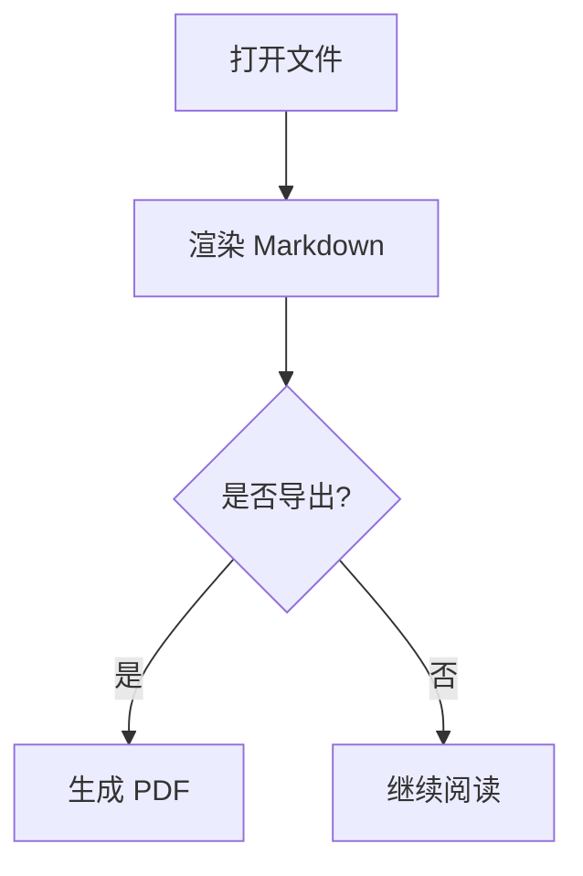

# 导出测试文档

本文件用于验证「导出为 PDF」功能是否完整保留渲染后的内容。

## 一、代码块与语法高亮

```javascript
function fibonacci(n) {
  if (n <= 1) return n;
  return fibonacci(n - 1) + fibonacci(n - 2);
}
```

无语言标识的代码块：

```
plain text code block
```

## 二、引用块

> 这是一段引用文字。导出的 PDF 中应保留左侧蓝色边框与浅蓝背景。

## 三、Mermaid 流程图



## 四、LaTeX 数学公式

行内公式：当 $a \ne 0$ 时，方程 $ax^2 + bx + c = 0$ 的解为：

$$
x = \frac{-b \pm \sqrt{b^2 - 4ac}}{2a}
$$

## 五、表格

| 格式 | 状态 | 说明 |
| --- | --- | --- |
| PDF | 已实现 | 通过 printToPDF 生成 |
| JPG | 敬请期待 | 暂未实现 |
| PNG | 敬请期待 | 暂未实现 |

## 六、文本样式

**加粗**、*斜体*、~~删除线~~、`行内代码`，以及[超链接](https://example.com)。

- 无序列表项一
- 无序列表项二

1. 有序列表项一
2. 有序列表项二
